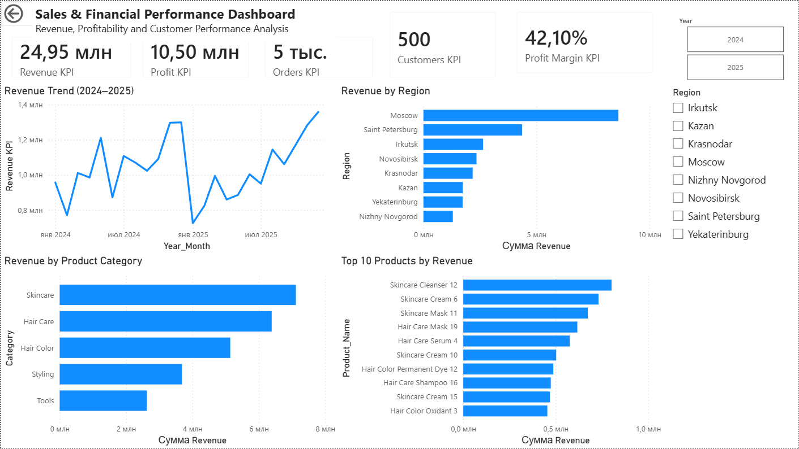
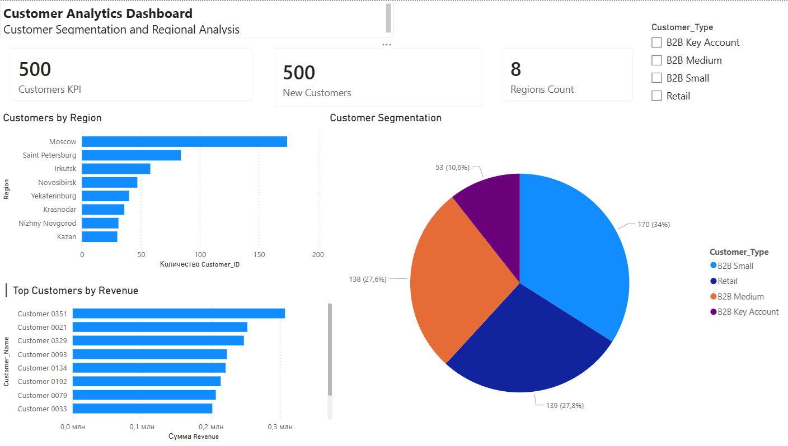
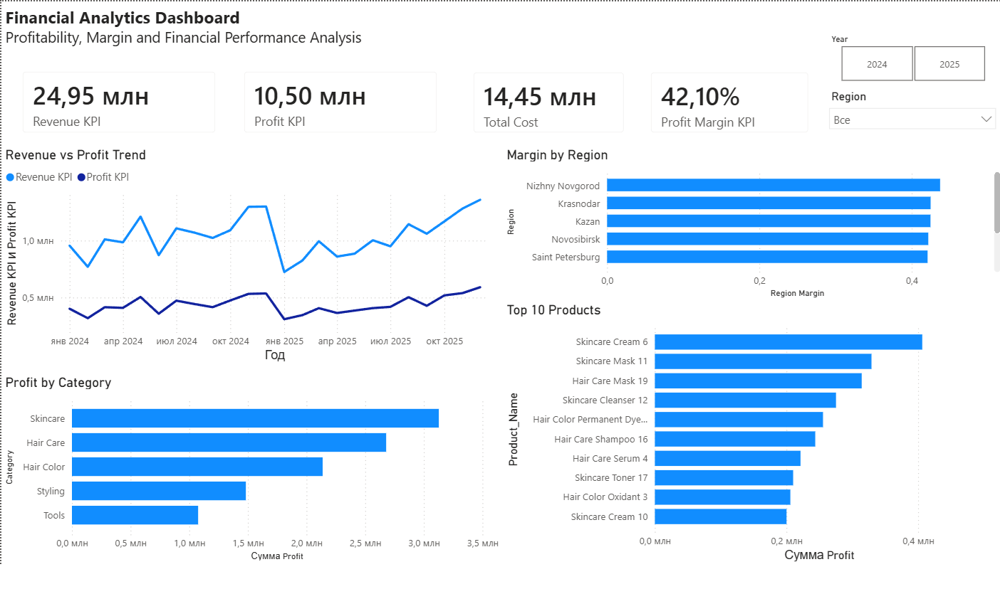

# Sales & Financial Performance Dashboard

## Overview

This project presents an interactive Power BI dashboard developed for sales, customer and financial performance analysis.

The dashboard provides management-level insights into revenue, profitability, customer segmentation and regional performance.

## Business Objective

The goal of the project is to help decision-makers monitor key business metrics and identify growth opportunities through data-driven insights.

## Dashboard Pages

### Executive Dashboard

- Revenue
- Profit
- Orders
- Customers
- Profit Margin
- Revenue Trend
- Revenue by Category
- Revenue by Region
- Top Products

### Customer Analytics

- Customer Segmentation
- Customers by Region
- Top Customers by Revenue
- Regional Customer Analysis

### Financial Analytics

- Revenue vs Profit Trend
- Profit by Category
- Profit Margin by Region
- Top Profitable Products

## Technologies

- Power BI
- DAX
- Data Modelling
- Excel
- Business Analytics

## Key Skills Demonstrated

- KPI Development
- Dashboard Design
- Financial Analysis
- Customer Segmentation
- Data Visualization
- Business Intelligence
- Data Modelling

## Screenshots

### Executive Dashboard

### Customer Analytics

### Financial Analytics

## Business Insights

- Total revenue reached 24.95M with a total profit of 10.50M.
- Overall profit margin is 42.10%.
- Moscow is the leading region by revenue.
- Skincare and Hair Care are the strongest product categories.
- The customer base includes 500 customers across 8 regions.

## Data Model

The dashboard is based on a star schema model:

- Sales as the fact table
- Customers as a customer dimension table
- Products as a product dimension table
- Calendar as a date dimension table

## Files

- Power BI dashboard (.pbix)
- Source dataset (.xlsx)
- Project documentation

## Author

Tim Konstantinov
